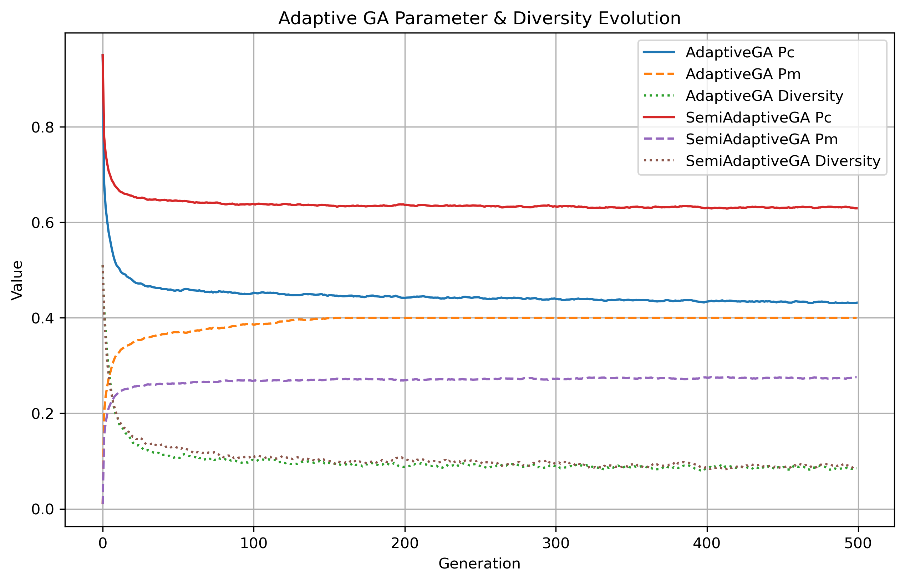
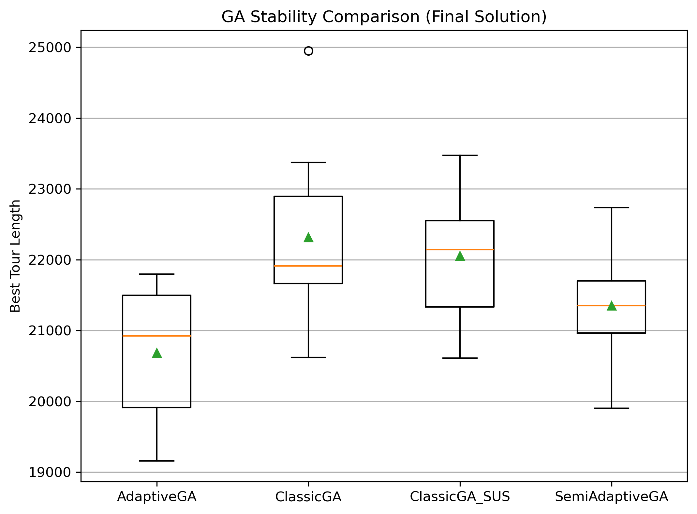

# GA_TSP_YZ

> 使用遗传算法求解 TSP 问题的python项目，包括经典 GA、Classic + SUS、Semi-Adaptive 与 Adaptive GA 四种策略。


This project implements a modular Genetic Algorithm (GA) framework for the Traveling Salesman Problem (TSP), with a focus on comparing different parameter control strategies. Based on a unified operator design (selection, crossover, and mutation), the framework includes classic GA, semi-adaptive GA, and fully adaptive GA variants.

The adaptive strategies adjust crossover and mutation probabilities according to population diversity and search progress, while hybrid selection mechanisms are explored to balance selection pressure and population stability. Multiple runs on standard TSPLIB instances are conducted, and detailed logs and visual analyses are provided to examine convergence behavior, parameter dynamics, and solution stability.

The primary goal of this project is to study the practical effects of adaptive mechanisms in genetic algorithms, rather than to propose a state-of-the-art solver. The results are intended to support understanding and discussion of GA design choices in an experimental and educational context.
---


---

## 算法说明

本项目实现了四种遗传算法策略：

| 算法 | 选择算子 | 交叉算子 | 变异算子 | 参数自适应 |
|------|-----------|-----------|-----------|------------|
| ClassicGA | Roulette Wheel | OX | Swap | 固定 Pc/Pm |
| ClassicGA_SUS | Stochastic Universal Sampling (SUS) | OX | Swap | 固定 Pc/Pm |
| SemiAdaptiveGA | Roulette / SUS 固定 | OX | Swap | Pc/Pm 基于多样性自适应 |
| AdaptiveGA | 混合选择 (RWS + SUS) | OX | Swap | Pc/Pm 基于多样性+停滞自适应 |

---

### 遗传算法核心公式

#### 1️⃣ 种群多样性（Population Diversity）

```la
\[
D(g) = \frac{1}{N(N-1)} \sum_{i=1}^{N} \sum_{j=1, j\neq i}^{N} d(X_i, X_j)
\]
```


其中 \(d(X_i, X_j)\) 可用边差异度或其他距离度量。

#### 2️⃣ 停滞代数（Stagnation）

\[
s(g) =
\begin{cases}
0, & \text{if } L_{\min}(g) < L_{\min}(g-1) \\
s(g-1) + 1, & \text{otherwise}
\end{cases}
\]

归一化：

\[
\hat{s}(g) = \min\left( \frac{s(g)}{S}, 1 \right)
\]

---

#### 3️⃣ AdaptiveGA Pc / Pm 更新公式

\[
\begin{aligned}
p_c^{(D)}(g) &= p_c^{\min} + D(g) \cdot (p_c^{\max} - p_c^{\min}) \\
p_m^{(D)}(g) &= p_m^{\max} - D(g) \cdot (p_m^{\max} - p_m^{\min}) \\
p_c(g) &= \mathrm{clip}\big(p_c^{(D)}(g)(1 - \alpha \hat{s}(g)),\, p_c^{\min},\, p_c^{\max} \big) \\
p_m(g) &= \mathrm{clip}\big(p_m^{(D)}(g)(1 + \beta \hat{s}(g)),\, p_m^{\min},\, p_m^{\max} \big)
\end{aligned}
\]

SUS 与 RWS 混合选择比例：

\[
r_{\text{SUS}}(g) = r_{\min} + \hat{s}(g) \cdot (r_{\max} - r_{\min})
\]

父代分配：

\[
\begin{aligned}
N_{\text{SUS}}(g) &= \lfloor N \cdot r_{\text{SUS}}(g) \rfloor \\
N_{\text{RWS}}(g) &= N - N_{\text{SUS}}(g)
\end{aligned}
\]

---

## 实验结果示例

### 收敛曲线


### 参数动态示意（AdaptiveGA / SemiAdaptiveGA）



### 收敛稳定性与运行时间




---

## 使用说明

1. 安装依赖：

```bash
pip install -r requirements.txt
````

2. 运行实验：

```bash
python experiment/run_experiment.py
```

3. 分析结果：

```bash
python analysis/analysis.py
```

4. 所有生成图片存储在：

```
analysis/experiment_results/figures/
```

---


