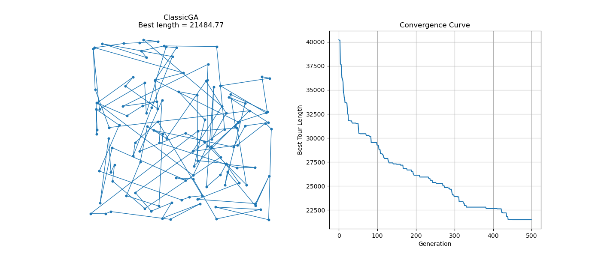
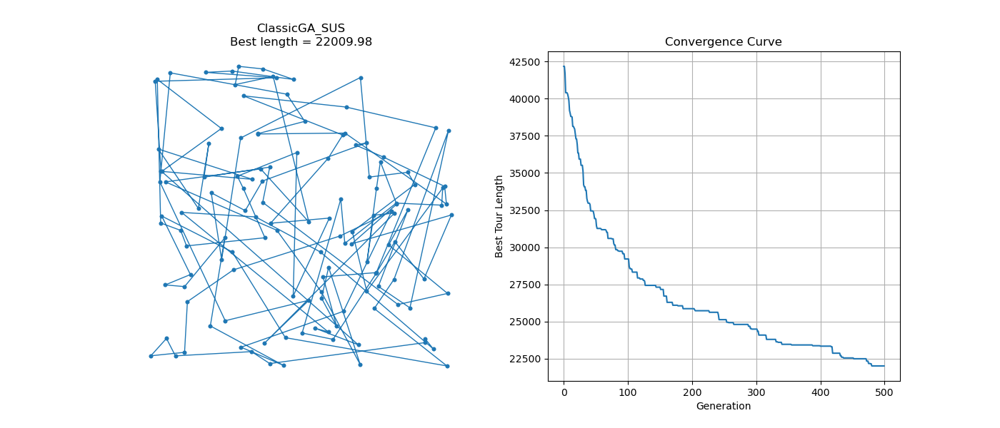
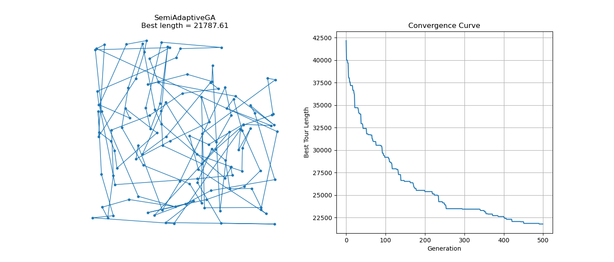
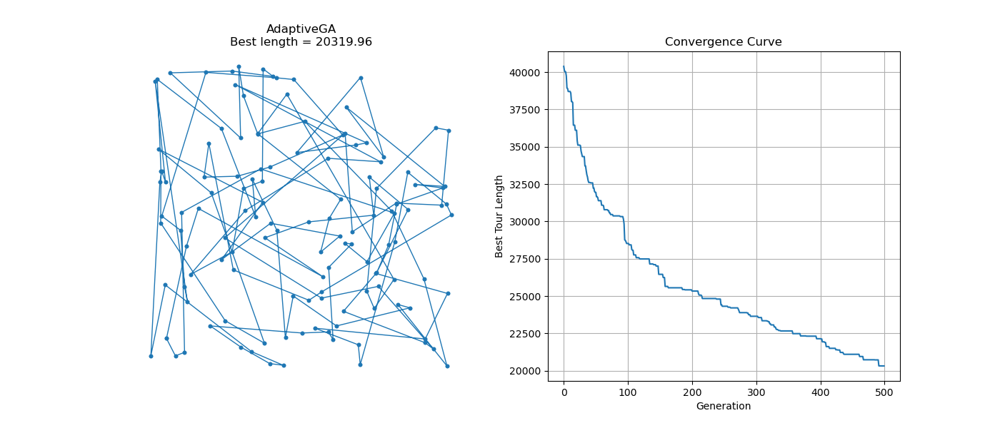
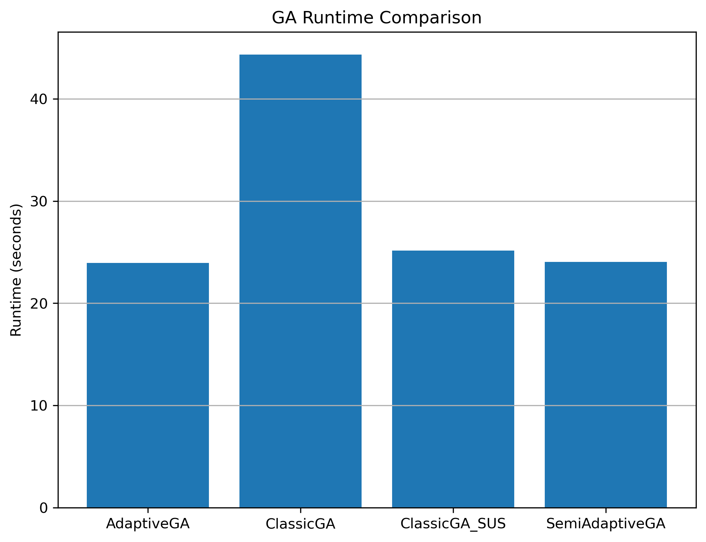

# GA_TSP_YZ

基于遗传算法（Genetic Algorithm, GA）的旅行商问题（TSP）求解实验项目。  
项目实现并对比了四种 GA 策略，重点研究**参数自适应机制、混合选择策略与种群多样性演化**。

---

## 项目结构

```

.
├─data
│   └─ch130.tsp 
├─ga
│   ├─engine.py    # 初始化 & 调用策略
│   ├─operators    # 算子
│   │   ├─selection.py
│   │   ├─crossover.py
│   │   ├─mutation.py
│   │   └─metrics.py
│   └─strategies    #算法
│       ├─classic.py
│       ├─classic_sus.py
│       ├─semi_adaptive.py
│       └─adaptive.py
├─experiment
│   └─run_experiment.py    # 实验设计 &  运行
│experiment_results
│   └─figures    # analysis.py的绘图位置 
├─analysis
│   ├─analysis.py
│   └─experiment_results
│       └─figures    # 除analysis.py的绘图脚本存储位置
└─README.md

````

---

## 算法概述

本项目实现并对比了以下四种遗传算法策略：

| 算法名称 | 选择算子 | 交叉算子 | 变异算子     | 参数机制 |
|--------|----------|----------|----------|----------|
| ClassicGA | Roulette Wheel (RWS) | OX | exchange | 固定 |
| ClassicGA_SUS | SUS | OX | exchange | 固定 |
| SemiAdaptiveGA | 固定（RWS / SUS） | OX | exchange | 基于多样性 |
| AdaptiveGA | 混合（RWS + SUS） | OX | exchange | 多样性 + 停滞代数 |

---

## 本实验中的自适应策略理论

### 1. 种群多样性（Population Diversity）

设种群规模为 $N$，个体为 $X_i$，则种群多样性定义为：

$$
D(g) = \frac{1}{N(N-1)} \sum_{i=1}^{N} \sum_{\substack{j=1 \\ j \neq i}}^{N} d(X_i, X_j)
$$

其中 $d(X_i, X_j)$ 表示两条路径的差异度（本项目中基于边差异实现）。

---

### 2. 停滞代数（Stagnation Counter）

记第 $g$ 代最优路径长度为 $L_{\min}(g)$：

$$
s(g) =
\begin{cases}
0, & L_{\min}(g) < L_{\min}(g-1) \\
s(g-1) + 1, & \text{otherwise}
\end{cases}
$$

归一化停滞代数：

$$
\hat{s}(g) = \min\left(\frac{s(g)}{S}, 1\right)
$$

其中 $S$ 为停滞阈值。

---

### 3. 自适应交叉与变异概率（AdaptiveGA）

基于多样性驱动的基础概率：

$$
\begin{aligned}
p_c^{(D)}(g) &= p_c^{\min} + D(g)(p_c^{\max} - p_c^{\min}) \\
p_m^{(D)}(g) &= p_m^{\max} - D(g)(p_m^{\max} - p_m^{\min})
\end{aligned}
$$

引入停滞代数调度后：

$$
\begin{aligned}
p_c(g) &= \mathrm{clip}\Big(p_c^{(D)}(g)\big(1 - \alpha \hat{s}(g)\big)\Big) \\
p_m(g) &= \mathrm{clip}\Big(p_m^{(D)}(g)\big(1 + \beta \hat{s}(g)\big)\Big)
\end{aligned}
$$

---

### 4. 混合选择策略（RWS + SUS）

SUS 选择比例定义为：

$$
r_{\text{SUS}}(g) = \mathrm{clip}\big(1 - D(g)\big)
$$

父代数量分配：

$$
\begin{aligned}
N_{\text{SUS}} &= \lfloor N \cdot r_{\text{SUS}}(g) \rfloor \\
N_{\text{RWS}} &= N - N_{\text{SUS}}
\end{aligned}
$$

---

## 实验结果可视化

### 收敛过程与最优路径






---

### 自适应参数与多样性演化


---

### 稳定性与运行时间




---

## 运行方式

安装依赖：

```bash
pip install -r requirements.txt
````

运行实验：

```bash
python experiment/run_experiment.py
```

生成分析图像：

```bash
python analysis/analysis.py
```

---

## 说明

* 所有实验结果以 JSON 形式保存在 `experiment_results/experiments/`

```
